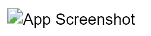

# <span style="color:#bf616a">README</span>
## <span style="color:#bf616a">Soy un readme</span> 

Crear un archivo readme.md como este
A brief description  of what this project does and who it´s for

### <span style="color:#ebcb8c">Installation</span>

Install my-proyect with npm 

```bash
    npm install my-proyect
    cd my-proyect
```
### <span style="color:#ebcb8c">Features</span>

- Ligth/dark mode toggle
- Live previews
- Fullscreen mode
- Cross platform 

### <span style="color:#ebcb8c">Lessons Learned</span>

What did you learn while building this project? What challenges did you face and how did you overcome them?

### <span style="color:#ebcb8c">Optimizations</span>

What optimizations did you make in your code? E.g. refactors, performance improvents, accessibility

### <span style="color:#ebcb8c">Links</span>


### <span style="color:#ebcb8c">About Me</span>

I'm a full stack developer


### <span style="color:#ebcb8c">Screenshots</span>



### <span style="color:#ebcb8c">Usage\Examples</span>

```js
import Component from 'my-project'

funtion app() {
    return <component />
}
```

### <span style="color:#ebcb8c">Used By</span>
This project is used by the following companies:

- company 1
- company 2


### <span style="color:#ebcb8c">Running Tests</span>

To run tests, run the following command

```bash
    npm run test
```

### <span style="color:#ebcb8c">Badges</span>

Add badges from somewhere like: <span style="color:#d3907a">Shields.io</span>


<span style="color:#FFF; background-color: #545454; border-radius: 10xp 0px 0px 15px; padding:4px">License</span><span style="color:#FFF; background-color: #7d9632; border-radius: 10xp 0px 0px 15px; padding:4px">MIT</span>

<span style="color:#FFF; background-color: #545454; border-radius: 10xp 0px 0px 15px; padding:4px">License</span><span style="color:#FFF; background-color: #d5ae22; border-radius: 10xp 0px 0px 15px; padding:4px">GPL v3</span>

<span style="color:#FFF; background-color: #545454; border-radius: 10xp 0px 0px 15px; padding:4px">License</span><span style="color:#FFF; background-color: #1283c4; border-radius: 10xp 0px 0px 15px; padding:4px">AGPL</span>


### 🛠️ Skills

Javascript, HTML, CSS...

### FAQ

#### Question 1

Answer 1

#### Questions 2

Answer 2

### Environment Variables

To run this project, you will need to add the following environment varibles to your .env file 

<span style="color:#88c0d0; background-color: #eceff4; border-radius: 10xp 0px 0px 15px; padding:4px">API_KEY</span>

<span style="color:#88c0d0; background-color: #eceff4; border-radius: 10xp 0px 0px 15px; padding:4px">ANOTHER_API_KEY</span>
